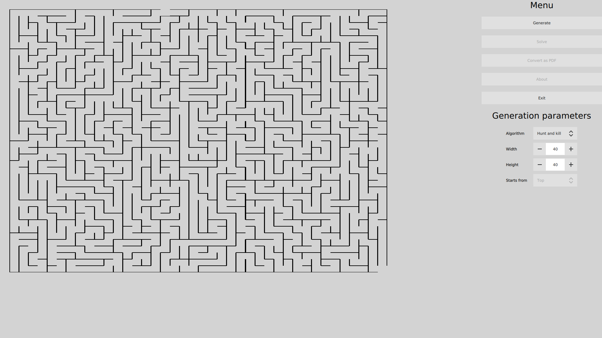

# MazeGenerator

## About

This application is a maze generator and visualizer, coded in C++17 / Qt (QML) and CMake. 
Unit tests are managed by Boost Test / ctest

ClangFormat is used to format the code.

## How to launch

- mkdir build
- cd build
- cmake ..
- make
- ./mazeGenerator

To launch unit tests : 
- ctest --verbose

Unit tests related classes are in "test" folder, and managed in a separated executable.

To launch KCacheGrind :
- ../runKCacheGrind.sh