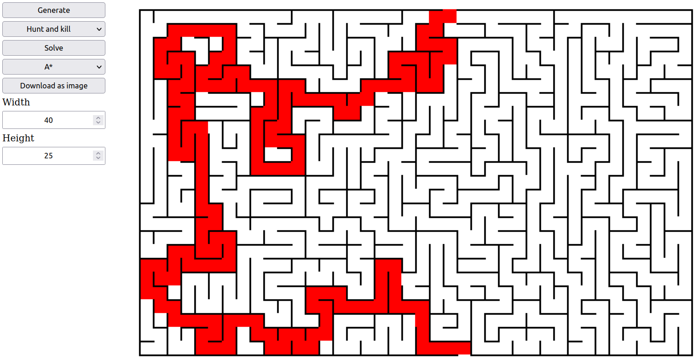

# About

This app is a maze generator and solver, written in C++ and running in your web browser.
It takes advantage of web assembly using Emscripten, which allows the Vue.js frontend to import the C++ maze generator as a Javascript module.

The following algorithms are implemented :
- solvers: A*, Dijkstra
- generators: Backtracking, Hunt and Kill

# How to launch

The following dependencies must be installed:
- CMake
- [Emscripten](https://emscripten.org/docs/getting_started/downloads.html#installation-instructions-using-the-emsdk-recommended)
- clang (needed for emscripten)
- node.js
- (optional) Boost.test to launch unit tests

Then just launch this script:
~~~
./launch_dev.sh
~~~

Compile and launch unit tests without the http server :
~~~
./launch_dev.sh --no-wasm
~~~